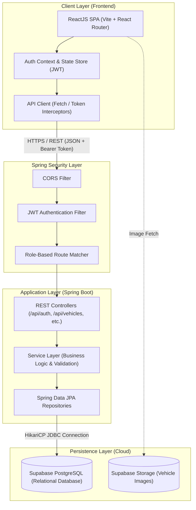
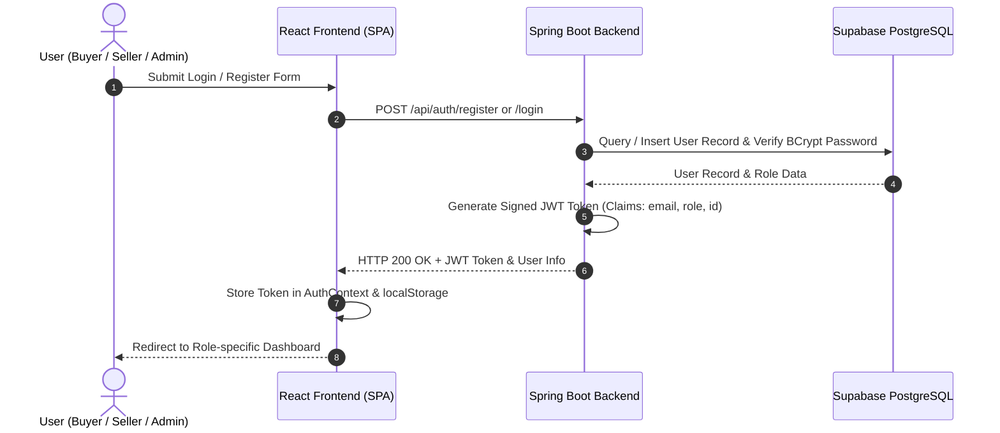
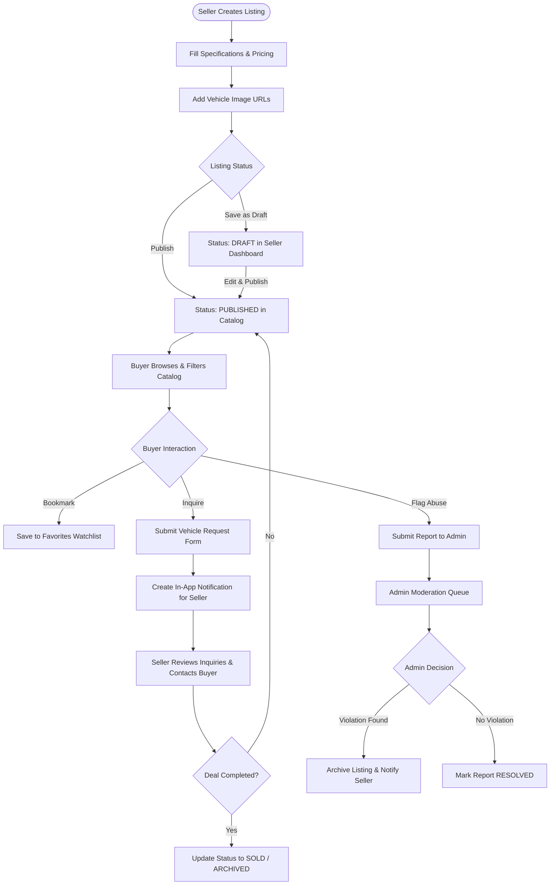
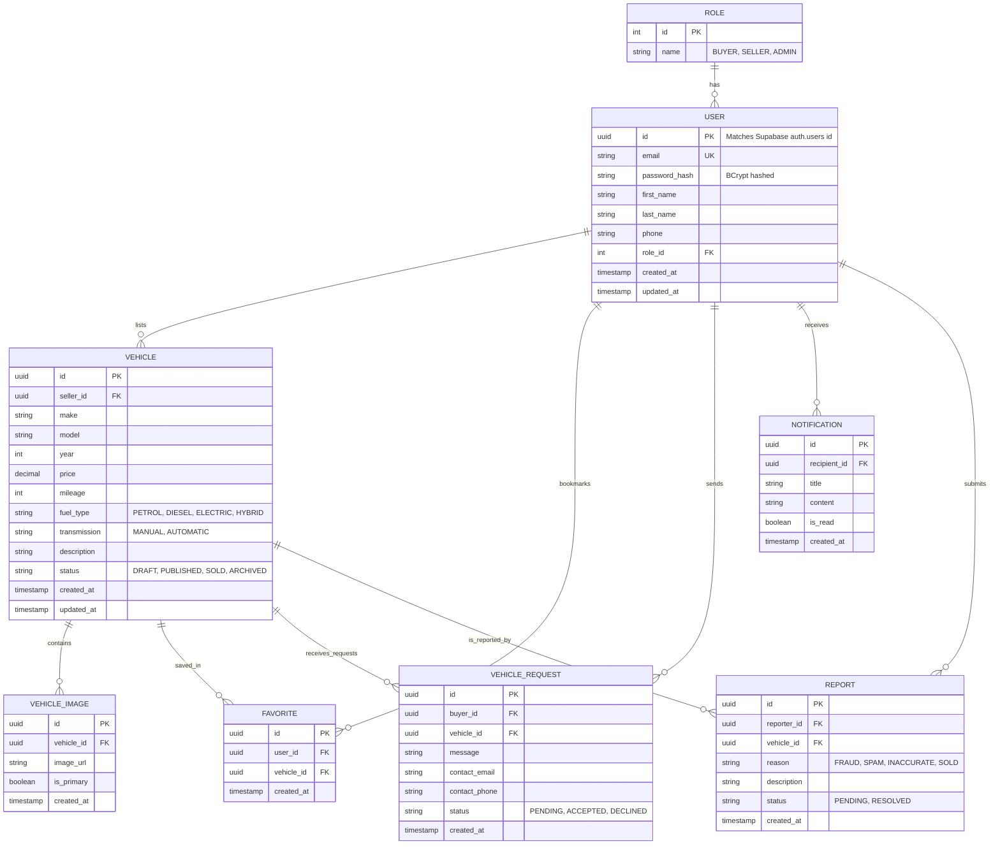

# Used Vehicle Trading Platform

This repository contains the complete design, documentation, and source code for the Used Vehicle Trading Platform, built as a college capstone project.

---

## 1. Project Title
**Used Vehicle Trading Platform**

---

## 2. Project Overview
The Used Vehicle Trading Platform is a multi-role, secure web application designed to facilitate transparent, safe peer-to-peer pre-owned vehicle listings and interest submissions. It bridges the trust gap between buyers and sellers through an administrative oversight workflow.

---

## 3. Problem Statement
Buying and selling used vehicles through informal channels lacks safety, features structured tracking, and security moderation. Read the detailed [PROBLEM_STATEMENT.md](file:///f:/autotrade/docs/PROBLEM_STATEMENT.md) for more details.

---

## 4. Proposed Solution
Our solution integrates distinct dashboards for Buyers, Sellers, and Admins to manage drafts, publishings, favorites, inquiries, and user behavior reports. Read the detailed [SOLUTION.md](file:///f:/autotrade/docs/SOLUTION.md).

---

## 5. Features

### IMPLEMENTED (Phases 1 - 6):
*   **Project Foundation:** Standard Spring Boot and React Vite dev setups.
*   **Health Check API:** Public endpoint (`GET /api/health`).
*   **Relational Database Scripts:** Production-ready PostgreSQL schemas, indexes, and seed files for Supabase.
*   **Database Integration (JPA/Hibernate):** Mapped Java entities, repositories, and verification endpoints.
*   **Authentication & Authorization:** Register/Login endpoint routing, BCrypt password hashing, JWT stateless validation filters, and role-based authority matching.
*   **Marketplace APIs:** Backend listing CRUD, soft-deletions (archiving), dynamic filter specifications, and image references.
*   **Complete UI Dashboard:** React SPA layout mapping home search catalog, seller CRUD tools, registration/login screens, and role-guarded routes.

### PLANNED (Future Phases):
*   **Buyer / Seller Features (Planned for Phase 7):** Bookmarking watchlists, submitting vehicle request inquiries.
*   **Admin Dashboard (Planned for Phase 7):** Resolving reported listings and moderation panels.
*   *For a complete breakdown of functional features, refer to the [REQUIREMENTS.md](file:///f:/autotrade/docs/REQUIREMENTS.md).*

---

## 6. Technology Stack
*   **Frontend:** ReactJS (Vite, Javascript, React Router, Vanilla CSS)
*   **Backend:** Java Spring Boot (Spring Web, Spring Security, Spring Data JPA)
*   **Database:** Supabase PostgreSQL (Relational tables)
*   **Build tool:** Maven
*   **Version control:** Git/GitHub

---

## 7. System Architecture & Flowcharts
The application uses a modular multi-tier layered architecture with secure JWT communication:

### 7.1 Architecture Flowchart


### 7.2 User Authentication & Authorization Flowchart


### 7.3 Vehicle Marketplace & Inquiry Lifecycle Flowchart


---

## 8. Database Overview & Entity-Relationship (ER) Diagram
### Status: IMPLEMENTED (Phase 2)
The database structure uses a clean relational layout using PostgreSQL native constraints, keys, and UUID structures.

### 8.1 Interactive Mermaid ER Diagram


### 8.2 Database Tables & Cardinality Details
1. **`roles` (`1:N` with `users`)**: System access permission groups (`BUYER`, `SELLER`, `ADMIN`).
2. **`users` (`1:N` with `vehicles`, `favorites`, `vehicle_requests`, `notifications`, `reports`)**: User accounts with BCrypt-hashed credentials.
3. **`vehicles` (`1:N` with `vehicle_images`, `favorites`, `vehicle_requests`, `reports`)**: Vehicle specifications, pricing, and lifecycle status (`DRAFT`, `PUBLISHED`, `SOLD`, `ARCHIVED`).
4. **`vehicle_images` (`N:1` with `vehicles`)**: Image URLs associated with listings.
5. **`favorites` (`N:1` with `users` and `vehicles`)**: Many-to-many watchlist bookmarks.
6. **`vehicle_requests` (`N:1` with `users` and `vehicles`)**: Structured buyer interest inquiries.
7. **`notifications` (`N:1` with `users`)**: Real-time alerts for user actions and updates.
8. **`reports` (`N:1` with `users` and `vehicles`)**: Moderation flags for trust & safety.

*For detailed schema definitions and SQL scripts, see [docs/ER_DIAGRAM.md](file:///f:/autotrade/docs/ER_DIAGRAM.md) and [backend/database/](file:///f:/autotrade/backend/database/).*

---

## 9. Project Structure
The repository is organized as follows:
```
autotrade/
├── .gitignore                 # Root level git ignore policies
├── README.md                  # This file
├── docs/                      # Project Design Documentation
│   ├── PROBLEM_STATEMENT.md
│   ├── SOLUTION.md
│   ├── SYSTEM_WORKFLOW.md
│   ├── ER_DIAGRAM.md
│   ├── SYSTEM_ARCHITECTURE.md
│   ├── REQUIREMENTS.md
│   ├── API_OVERVIEW.md
│   └── PROJECT_PHASES.md
├── backend/                   # Maven Spring Boot application
│   ├── pom.xml
│   ├── database/              # Relational SQL Scripts (Phase 2)
│   │   ├── 01_schema.sql
│   │   ├── 02_indexes.sql
│   │   ├── 03_seed_data.sql
│   │   └── README.md          # Database setup guides
│   └── src/
└── frontend/                  # ReactJS SPA application (Vite-scaffolded)
    ├── package.json
    ├── index.html
    ├── .env.example           # Example local variables
    └── src/
        ├── App.jsx            # Dynamic client-side routing & route guards
        ├── main.jsx
        ├── App.css            # Dark mode slate theme styles
        ├── components/
        │   ├── Navbar.jsx     # Navigation bar (dynamic links per role)
        │   └── VehicleCard.jsx # Listing preview element
        ├── context/
        │   └── AuthContext.jsx # Global JWT session provider
        ├── services/
        │   └── api.js         # API client & 401 redirect listener
        └── pages/
            ├── Home.jsx       # Catalog browser with make/model/price filters
            ├── VehicleDetail.jsx # Spec details & image galleries
            ├── Login.jsx      # Login page
            ├── Register.jsx   # Register page (BUYER/SELLER only)
            ├── SellerDashboard.jsx # Seller CRUD listings table
            ├── VehicleForm.jsx # Listing spec input (Create & Edit)
            ├── ImageManager.jsx # URL reference additions & deletions
            └── AdminDashboard.jsx # Administration placeholder landing
```

---

## 10. Setup Instructions
To initialize the project:
1. Clone the repository.
2. Set up the database on Supabase using the guide in [backend/database/README.md](file:///f:/autotrade/backend/database/README.md).
3. Set up the local environment variables listed in Section 11 (Copy `.env.example` in frontend to `.env`).
4. Build and run the backend using Maven (Section 12).
5. Build and run the frontend using npm (Section 13).

---

## 11. Environment Variables
### Backend Configuration
Configure the following local environment variables to connect to Supabase and initialize JWT:
```properties
SUPABASE_DB_URL=jdbc:postgresql://db.[your-supabase-reference].supabase.co:5432/postgres?sslmode=require
SUPABASE_DB_USERNAME=postgres
SUPABASE_DB_PASSWORD=your_supabase_password
JWT_SECRET=your_base64_encoded_jwt_secret_key_at_least_256_bits_long
JWT_EXPIRATION_MS=86400000
```

### Frontend Configuration
Create `frontend/.env` based on `frontend/.env.example`:
```env
VITE_API_BASE_URL=http://localhost:8081/api
```

---

## 12. Backend Execution
To run the Spring Boot backend locally:
```bash
# Set environment variables first (example in PowerShell):
$env:SUPABASE_DB_URL="jdbc:postgresql://db.[reference].supabase.co:5432/postgres?sslmode=require"
$env:SUPABASE_DB_USERNAME="postgres"
$env:SUPABASE_DB_PASSWORD="your_password"
$env:JWT_SECRET="TestingSecretKeyForJWTSigningThatIsAtLeast256BitsLongAndSecureEnoughForTests12345"

cd backend
mvn spring-boot:run
```

---

## 13. Frontend Execution
To run the ReactJS frontend locally:
```bash
cd frontend
cmd /c npm install
cmd /c npm run dev
```

---

## 14. User Roles and Authorization
The UI dynamically adapts to the logged-in user's role:
*   **Guest (Unauthenticated):** Can browse published listings, search/filter, and view details. Redirected to Login if trying to access dashboard routes.
*   **BUYER:** Can browse/search/filter listings and view vehicle detail layouts.
*   **SELLER:** Accesses the Seller Dashboard to create listings, update listing details, upload image URLs, publish listings, and archive listings.
*   **ADMIN:** Accesses the Admin Dashboard placeholder informing of planned moderation features.

---

## 15. React Page Routes
*   `/` — Home Catalog Search.
*   `/login` — Login screen.
*   `/register` — Registration form (blocks ADMIN inputs).
*   `/vehicles/:id` — Specification details and image gallery lookup.
*   `/seller/dashboard` — Seller listings manager (Protected).
*   `/seller/vehicles/new` — Create new listing (Protected).
*   `/seller/vehicles/:id/edit` — Edit listing specs (Protected).
*   `/seller/vehicles/:id/images` — Manage image URL references (Protected).
*   `/admin/dashboard` — Administrative portal landing page (Protected).
