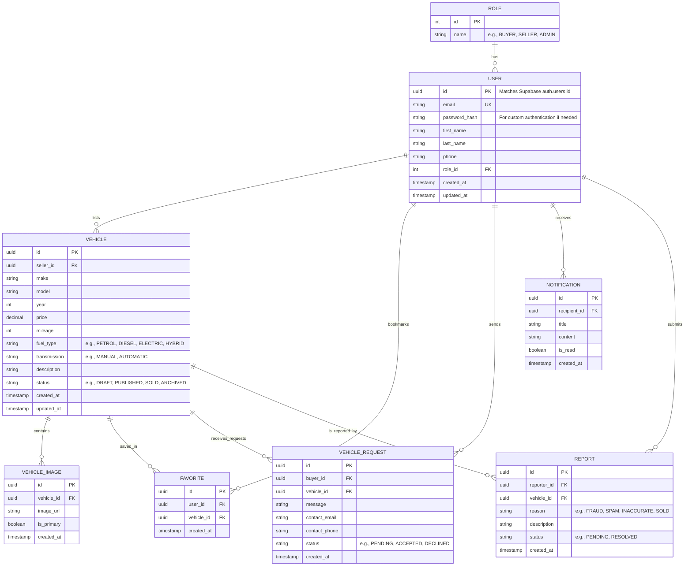

# Entity Relationship Diagram

This document contains the Entity Relationship (ER) diagram for the Used Vehicle Trading Platform database. It is written using Mermaid syntax and is fully compatible with GitHub preview.

## Mermaid ER Diagram

## Relationship & Cardinality Details

1.  **ROLE to USER (`1:N`)**: A Role can be assigned to multiple users, but a user has exactly one primary role (Buyer, Seller, or Admin).
2.  **USER to VEHICLE (`1:N`)**: A Seller (User) can list multiple vehicles. A vehicle is owned/listed by exactly one Seller.
3.  **VEHICLE to VEHICLE_IMAGE (`1:N`)**: A vehicle can have multiple uploaded images. Each image belongs to exactly one vehicle.
4.  **USER and VEHICLE to FAVORITE (`1:N` & `1:N`)**: M-to-N join table to track bookmarks. A user can favorite many vehicles, and a vehicle can be favorited by many users.
5.  **USER and VEHICLE to VEHICLE_REQUEST (`1:N` & `1:N`)**: Represents interest inquiry. A Buyer (User) can send requests on multiple vehicles, and a vehicle can receive inquiries from multiple buyers.
6.  **USER to NOTIFICATION (`1:N`)**: A user can receive zero or more notifications.
7.  **USER and VEHICLE to REPORT (`1:N` & `1:N`)**: A user can report multiple vehicles. A vehicle can be reported multiple times by different users.
