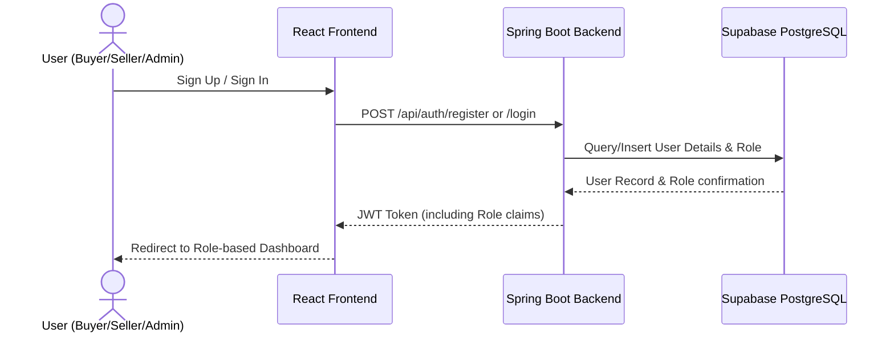
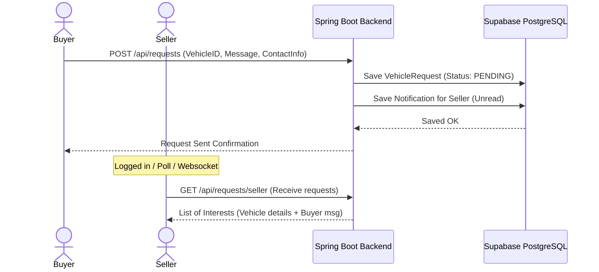

# System Workflow

This document details the core workflows and interaction patterns within the Used Vehicle Trading Platform.

---

## 1. User Registration & Authentication

*   **Roles:** Defaults to `BUYER` or `SELLER`. `ADMIN` accounts are seeded or set manually in the database.
*   **Tokens:** All subsequent requests send the JWT in the `Authorization: Bearer <token>` header.

---

## 2. Vehicle Listing Creation & Publishing (Seller)
1.  **Draft Creation:** Seller fills out the vehicle details form and uploads vehicle images.
2.  **Upload & Store:** 
    *   Images are uploaded to Supabase Storage, returning public URLs.
    *   Seller submits form to Spring Boot Backend (`POST /api/vehicles`).
3.  **Persistence:** The backend saves the `Vehicle` record and corresponding `VehicleImage` records (referencing URLs) with status `DRAFT` or `PUBLISHED`.
4.  **Publishing:** Once published, the vehicle listing becomes searchable by all buyers.

---

## 3. Vehicle Browsing, Search & Favorites (Buyer)
1.  **Search & Filter:** Buyer inputs criteria (e.g., Make: "Toyota", Max Price: 15000).
2.  **Fetch Catalog:** Frontend requests `GET /api/vehicles?make=Toyota&maxPrice=15000`.
3.  **Toggle Favorite:** Buyer clicks "Favorite". Frontend sends `POST /api/favorites?vehicleId=123`.
    *   Backend saves a mapping in the `Favorite` table connecting `User` and `Vehicle`.
    *   Buyer can view all saved favorites in their personal watchlist.

---

## 4. Vehicle Interest / Request (Buyer to Seller)

---

## 5. Report Submission & Resolution (User to Admin)
1.  **Report Submission:** A user (Buyer or Seller) spots a fake or abusive listing and clicks "Report".
    *   Sends `POST /api/reports` with `vehicleId`, `reason`, and `description`.
    *   Status of the report is set to `PENDING`.
2.  **Admin Review:** Admin logs in and navigates to the Admin Panel.
    *   Requests `GET /api/reports` to see all pending reports.
3.  **Resolution:** Admin decides to take action:
    *   **Dismiss:** Admin updates report status to `RESOLVED` with comments. No change to listing.
    *   **Take Down:** Admin deactivates/archives the `Vehicle` listing (`PATCH /api/vehicles/{id}/status?status=ARCHIVED`) and marks the report as `RESOLVED`.
